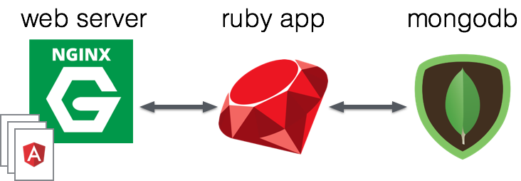

# TP Docker

## Objectif

Le but de ce TP est de prendre en main Docker et de comprendre pourquoi cet outil est de plus en plus utilisé. Pour cela, une première partie va vous permettre de vous familiariser avec le principe de Docker. 

Dans une deuxième partie, vous allez monter une architecture complète composée d'un serveur, d'une application et d'une base de données. En utilisant Docker, cette architecture sera facilement déployable et "scalable".

## Premiers Pas

### Installer Docker

Rendez-vous sur la [documentation de Docker](https://docs.docker.com) et suivez les étapes pour installer Docker sur votre machine.

Pour vérifier que Docker est bien installé, exécutez la commande suivante :

```
$ docker -v
```

Cela devrait retourner la sortie suivante (ou un truc similaire) :

```
Docker version 1.12.1, build 6f9534c
```

### Lancer un container

Un container Docker est une instance qui permet d'isoler une partie des ressources du système. Un container est différent d'une machine virtuelle de part son architecture avec le système (cf. Cours). 

Pour commencer, nous allons lancer un container ```Ubuntu```.

```
docker run ubuntu /bin/echo 'Hello world'
```

Cette commande permet de lancer un container basé sur une image ```Ubuntu```. Ce dernier va exécuter la commande "echo" afin d'afficher un "Hello World" à l'écran. 

> Pour ceux qui n'ont pas le TOEIC, comprenez : "Bonjour le monde"
 
À la suite de ça, le container meurt 😭.

### Daemoniser un container

Exécuter la commande suivante :

```
$ docker run -d ubuntu /bin/sh -c "while true; do echo 'I am a daemon 😈'; sleep 1; done"
```

L'option ```-d``` permet de daemoniser le container. Celui-ci tourne en background. Vous ne voyez pas d'output mise a part un ```containerID```.

### Toc toc toc... Qui est là ?

Affichez la liste des containers actifs sur votre machine en utilisant ```docker ps```. Vous devriez retrouver votre container ```Ubuntu``` qui tourne sur votre machine host.

Grâce à ```docker ps -a``` vous pouvez avoir la liste de tous les containers déjà créés, actifs ou non. Si vous voulez relancer un ancien container utilisez :

```
docker start <CONTAINER_ID>
```

### Soyez fort, reprenez le dessus

Retrouvez la sortie standard de votre container en l'attachant :

```
$ docker attach <CONTAINER_ID>
```

### Interactive

Lancez un shell sur un container interactif en utilisant la commande suivante :

```
$ docker run -it ubuntu /bin/bash
```

L'option ```-i``` permet de garder la main sur le container. L'option ```-t``` crée un ```TTY``` pour le container. Retenez ici que ```-it``` permet de faire un container interactif.

Vous pouvez alors exécuter des commandes sur un système Linux qui tourne sur un container Docker de votre machine Linux **#inception**. 

> T'as je veux dire pas ? #b2o

## Binding

Le but de cette partie est de vous faire installer un serveur web Nginx sur un container docker.

1. Lancez un shell interactif sur un container basé sur une image Ubuntu. N'oubliez pas de binder un port de la machine host (le port 80 par exemple) au port 80 de votre container.
2. Installez Nginx
3. Sur votre machine locale, ouvrez votre navigateur favori et rendez-vous sur ```http://<VOTRE-ADRESSE-IP>:<VOTRE-PORT>```. Vous devriez voir la page d'accueil nginx.

> Pour info, l'INSA n'autorise des connexions que sur les ports 80 et 443.

Vous accédez alors à votre serveur web qui tourne sur le container. C'est super mais ça sert à quoi ?

> Tkt morray. Tu vas voir ça après !

## Dockerfile 

Nous avons vu comment créer des containers, les lancer et les binder au port de la machine host. Mais le vrai intêret de Docker, c'est de pouvoir définir des containers qui tourneront sur n'importe quelle machine. Fini les :

> "But it worked on my machine"

Ou pour ceux qui n'ont pas le TOEIC :

> "Mais ça marchait sur ma machine !

En vous aidant du cours, créez un fichier ```Dockerfile``` qui : 

- Se base sur une image ```ubuntu```
- Installe un ```nginx```
- Expose le port 80

Buildez l'image de votre container basé sur le Dockerfile en utilisant la commande suivante :

```
$ docker build -t <name:version> .
```

Consultez la liste des images disponibles localement avec :

```
$ docker images
```

Vous devriez voir apparaître votre nouvelle image. Voilà, vous pouvez désormais lancer plusieurs petits bébés nginx sur votre machine en utilisant :

```
$ docker run -dit -p 80:80 <name:version> nginx -g "daemon off;"
```

> L'option de ```-g``` permet de rajouter une direction en dehors du fichier de configuration. Ici, on mentionne que ```nginx``` ne tourne pas en tant que daemon ce qui permet de garder le container actif.

Exécutez un ```docker ps``` pour voir votre liste des containers actifs. Vous pouvez arrêter un container à l'aide de :

```
$ docker stop <CONTAINER_ID>
# OR
$ docker stop <CONTAINER_NAME>
```

## Docker Hub

Une manière plus simple de monter un container ```nginx``` est d'utiliser l'image officielle disponible sur ```Docker Hub```. Pour se faire, rendez-vous sur [https://hub.docker.com](https://hub.docker.com). Vous pourrez alors chercher des images préfaites telles que celle de ```nginx```. 

Vous pouvez également utiliser le terminal pour explorer ```Docker Hub``` :

```
$ docker search <name> # for instance "nginx"
```

Pour télécharger une image, exécutez :

```
$ docker pull nginx
```

Désormais, lancez le container basé sur l'image nginx en exécutant :

```
$ docker run -dit -p 80:80 nginx
# docker run -dit -p <PORT_HOST>:<PORT_CONTAINER> <img_name>
```

## Volume partagé 

Super, on sait monter un container ```nginx```, mais on aimerait bien pouvoir le configurer un petit peu et mettre une page d'accueil custom HTML. Par défaut, ```nginx``` distribue les fichiers présents dans le répertoire ```/usr/share/nginx/html/```. Ainsi, si vous créez un fichier ```index.html``` dans ce répertoire du container, vous allez changer la page d'accueil de ```nginx```.

Pour partager un volume entre la machine host et le container, il suffit d'utiliser l'option ```-v <HOST_DIR>:<CONTAINER_DIR>``` pour exécuter l'équivalent d'un binding mais pour le partage de volume.

Sur votre host (eg. seveur distant), créez un répertoire ```nginx```. Dans ce répertoire, créez un fichier ```index.html``` et ajoutez-y du code.

> Faites pas un truc qui clignotte, ça fait mal aux yeux 😎. 

Vous pouvez utiliser le squelette HTML disponible [ici](http://colorier.rapide.net/images/squelette-3.jpg). Depuis le répertoire ```nginx```, lancez un container "nginx" avec l'option ```-v```, tel que :

```
$ docker run -dit -p 80:80 -v $PWD:/usr/share/nginx/html nginx 
```

Ici, on indique que notre répertoire courant ```$PWD``` sera relié à ```/usr/share/nginx/html```. Ce dernier répertoire est le répertoire du serveur web nginx. Rendez-vous sur ```http://<VOTRE_ADRESSE_IP>```.

Il est possible de partager des fichiers, ou bien de copier des fichers sur le container en utilisant ```docker cp``` ou la directive ```COPY``` dans le Dockerfile.

## Cheatsheet Docker

Bob a souhaité vous transmettre sa cheatsheet Docker, une liste de commandes bien utiles qui vous sauveront la vie quand vous sortirez de l'INSA. Mais pour plus de sécurité, et comme Bob a fait l'option TMMD en 5INFO (même si à la base c'est un LSR mais ce n'est pas l'objet du problème ici), il a chiffré avec un algorithme "super-puissant" le contenu suivant :

```
$ithpjw%wzs%ANRFLJC%AHTRRFSIdYTdJ]JHZYJC%(%xyfwy%f%htsyfnsjw$ithpjw%wzs%2ny%ANRFLJC%4gns4gfxm%(%xyfwy%f%htsyfnsjw%fsi%ljy%ymj%xmjqq$ithpjw%wzs%2i%ANRFLJC%AHTRRFSIdYTdJ]JHZYJC%(%xyfwy%f%htsyfnsjw%ns%ymj%gfhplwtzsi$ithpjw%wzs%`333b%2u%UTWYdMTXY?UTWYdIJXY%ANRFLJC%AHTRRFSIdYTdJ]JHZYJC%(%gnsi%utwy%tk%f%htsyfnsjw$ithpjw%wzs%`333b%2{%ufym4yt4mtxy4inw?ufym4yt4htsyfnsjw4inw%ANRFLJC%AHTRRFSIdYTdJ]JHZYJC%(%xmfwj%{tqzrj%gjy|jjs%mtxy%rfhmnsj%fsi%htsyfnsjw$$ithpjw%ux%(%qnxy%fqq%wzssnsl%htsyfnsjw$ithpjw%xytu%AHTSYFNSJWdNIC%(%xytu%f%ln{js%htsyfnsjw%nyx%NI$ithpjw%xytu%ASFRJdNIC%(%xytu%f%ln{js%htsyfnsjw%|nym%nyx%sfrj$ithpjw%xyfwy%AHTSYFNSJWdNIC%(%xyfwy%f%ln{js%htsyfnsjw%nyx%NI$ithpjw%xyfwy%ASFRJdNIC%(%xyfwy%f%ln{js%htsyfnsjw%|nym%nyx%sfrj$ithpjw%fyyfhm%AHTSYFNSJWdNIC%(%fyyfhm%f%ifjrtsn
ji%ithpjw$$ithpjw%gznqi%2y%ASFRJ?[JWXNTSC%AUFYM4YT4ITHPJWKNQJC%(%gznqi%fs%nrflj%kwtr%ymj%ithpjwknqj%qthfyji%ns%ymj%ln{js%inwjhytw~$ithpjw%nrfljx%(%qnxy%fqq%qthfq%f{fnqfgqj%nrfljx$$ithpjw%xjfwhm%ANRFLJdSFRJC%(%xjwfhm%nrfljdsfrj%ymwtzlm%Ithpjw%Mzg$ithpjw%uzqq%ANRFLJdSFRJC%(%it|sqtfi%nrfljdsfrj%qthfqq~%kwtr%Ithpjw%Mzg$$(Ithpjwknqj$KWTR%AnrfljdgfxjC$RFNSYFNSJW%A~tzwdsfrjC%{jwxnts?%A{jwxntsdszrgjwC$WZS%Ahtrrfsidytdj}jhzyjC$J]UTXJ%Autwydytdj}utxjC$HTU^%AufymdtsdmtxydrfhmnsjC%AufymdtsdhtsyfnsjwC$JSYW^UTNSY%Ahtrrfsidytdwzsd|mjsdxyfwynsldhtsyfnsjwC$$
```

> On précise que Bob avait demandé LSR quand même !

Pour déchiffrer ce message, il vous faut exécuter du code ```ruby``` sur votre machine. Seulement, ```ruby``` n'est pas installé sur la machine qui vous est fournie. Mais comme Bob a suivi le cours sur Docker, il a mis à disposition une image sur ```docker hub```. Cette image embarque l'environnement nécessaire pour faire tourner son super programme pour déchiffrer le message.

> "Merci qui ? 😉"

> "Merci Bob bien sûr !" (tu t'es cru où là ?) #JM4ever


Vous devez créer un container à partir de l'image ```fthomasmorel/tp_docker_insa```. Lancez ce container afin qu'il exécute la commande ```decrypt``` qui prend en paramètre la chaîne de caractères chiffrée entre ```''```.

## RubyChat

Dans cette deuxième partie, vous allez devoir monter une architecture avec un client web, une API Ruby et une base de données _moderne_ mongoDB.

Commencez par créer un répertoire nommé ```RubyChat```. Clonez les deux GIT suivants dans ce répertoire :

```
git clone https://github.com/fthomasmorel/RubyChat-frontend.git RubyChat-Front
git clone https://github.com/fthomasmorel/RubyChat-backend.git RubyChat-Back
```

### RubyChat

RubyChat est une application en passe de rivaliser avec les plus grandes applications _modernes_ de messageries instantannées telles que AIM, MSN ou ICQ.

La particularité de RubyChat est qu'il n'existe qu'un seul et unique canal. En outre, tous les messages sont centralisés sur une seule fenêtre de conversation. Cela permet de communiquer avec le monde entier de manière très simple 🖖🏼.

D'un point de vue technique, l'application est composée d'une API REST Ruby qui met à disposition deux endpoints:

```
GET /messages # return all the messages of the chat
POST /messages # post a message from the json body on the chat
```

Un message a pour structure :

```
{
	username: String 		# the sender username
	content: String 		# the message content
	date: Date 				# the date when the message has been posted
}
```

De l'autre coté, une partie front-end, écrite en AngularJS, permet d'afficher l'ensemble des messages ainsi que d'en envoyer.

L'application est en train de grimper dans les charts, et l'équipe de développeurs commence à penser au futur.

- Comment rendre l'application RubyChart "scalable" pour supporter la charge des futurs 100 000 000 d'utilisateurs ? 
- Comment permettre aux développeurs de maintenir facilement leur code ?
- Quel workflow adopté ?

### RubyChat-Back

La partie backend de l'application a été écrite en ```ruby```. Ce langage utilise un gestionnaire de paquets appelé ```gem```. Cela permet d'installer des dépendences facilement :

```
gem install <packages> # install the given package on the machine
```

Voici les dépendences de l'API :

```
sinatra						# framework for the API REST design
mongo						# ruby client for mongoDB
bson_ext					# mongoDB stuff
sinatra-cross_origin		# sinatra stuff to handle cross_origin 
json						# json lib
```

Le code entier de l'API est contenu dans ```rubychat.rb```. L'application reçoit des requêtes HTTP sur le port ```8080```.

### RubyChat-Front

L'application web, quant à elle, a été écrite avec le framework AngularJS (v1). Voici l'architecture du répertoire RubyChat-Front :

```
|
|--css/ 				# contains the CSS for the web app
|--js/
|	 |---login.js 		# contains the code to log in the chat
|	 |---chat.js 		# contains the code to read and send messages
|
|--templates/
|	 |---login.html 	# contains the code for the login view in html
|	 |---chat.html 		# contains the code for the chat view in html
|
|--app.config.js 		# define constant for the web app (API URL)
|--app.js				# define the AngularJS app
|--index.html			# the index page of the web app
|--nginx.conf			# nginx config file TO COMPLETE
|--LICENCE				# who cares?
```

### Architecture 



Le serveur web ```nginx``` permet de servir les fichiers de la partie web. Aussi, il redirige les requêtes qui arrivent sur ```/api``` vers l'application ```ruby```. Cette dernière communique avec la base de données ```mongo```.

## Docker-compose

Afin de répondre aux problématiques posées par les développeurs de RubyChat, vous allez devoir "dockeriser" les différents modules de l'application. Le but de l'exercice est de voir comment on peut monter une architecture telle que celle de RubyChat en utilsant des containers.

### RubyChat-Front

La première étape consiste à créer des containers pour chacune des instances suivantes :

- L'application ruby
- mongoDB
- nginx

### Ruby

Créez un ```Dockerfile``` dans le répertoire ```RubyChat-Back```. En partant de l'image docker de base ```ruby```, vous allez devoir définir l'environnement nécessaire à la bonne exécution du script ```rubychat.rb``` (cf. définition plus haut). Vous devez :

- Installer les dépendences sur le container
- Copier le code source sur le container
- Exposer le port de l'API
- Définir un point d'entrée pour exécuter ```rubychat.rb```

Une fois le ```Dockerfile``` défini, vous pouvez le build avec la commande suivante :

```
docker build -t ruby_api:v1 .
```

Le container ```ruby``` n'ayant pas accès à la base de données mongoDB, il ne peut fonctionner pour l'instant.

### nginx

Pour le container ```nginx```, nous allons partir de l'image de base Docker ```nginx```. Dans le répertoire ```RubyChat-Front```, créez un fichier ```Dockerfile```. Puis, vous devez :

- Partir de l'image de base ```nginx```
- Copier le fichier ```nginx.conf``` du répertoire Front dans ```/etc/nginx/nginx.conf``` côté container.
- Copier l'ensemble des fichiers ```angularJS``` sur le container
- Exposer le port d'écoute de votre ```nginx``` (port 80).

Enfin, vous pouvez build ce container :

```
docker build -t rubychat_nginx:v1 .
```
Pour le moment, nginx ne connait pas encore le host pour joindre l'API ```ruby```, il ne vous est pas possible de lancer le container pour l'instant.

### mongoDB

Pour le container ```mongoDB```, rien de plus simple. Il suffit d'utiliser l'image de base Docker ```mongo```. Elle vous permettra de faire tourner une instance de mongoDB facilement.

### Configurer docker-compose

Premièrement, installez ```docker-compose``` avec les commandes suivantes :

```
$ curl -L "https://github.com/docker/compose/releases/download/1.8.1/docker-compose-$(uname -s)-$(uname -m)" > /usr/bin/docker-compose
$ chmod +x /usr/bin/docker-compose
$ docker-compose --version
```

```docker-compose``` a besoin de deux fichiers pour être configuré. Un fichier ```docker-compose.yml``` qui permet de définir les containers et leur liens, et un fichier ```requirements.txt``` qui permet de lister les images nécessaires à l'architecture définie dans le ```docker-compose.yml```.

À la racine du dossier ```RubyChat```, créez ces deux fichiers. Dans le fichier ```requirements.txt```, listez les images de bases que vos containers utilisent :

```
ruby
mongo
nginx
```

Dans le fichier ```docker-compose.yml```, complétez le squelette (un vrai, cette fois) suivant :

```
version: '2'
services:
  nginx:
    build: ...		# Path to your web server Dockerfile
    ports:			# Port binding between the host machine and the nginx 
     - "<PORT_HOST>:<PORT_CONTAINER>"	
    depends_on:
      - ... 		# Container on which nginx depends on
  ruby_api:
    build: ...		# Path to your ruby app Dockerfile
    depends_on:
     - ...			# Container on which ruby_api depends on
  mongo:
    image: ...		# Image for the mongodb container
```

Pensez à mettre à jour les URL de l'API dans la partie ```AngularJS``` et aussi l'host pour la base de données dans le code de l'API ```ruby```. Pour tester votre installation, utilisez :

```
docker-compose up # use the --build option to force rebuilding images
```

Utilisez votre instance de RubyChat sur [http://VOTRE_ADRESSE_IP/login](). 

# 🐳